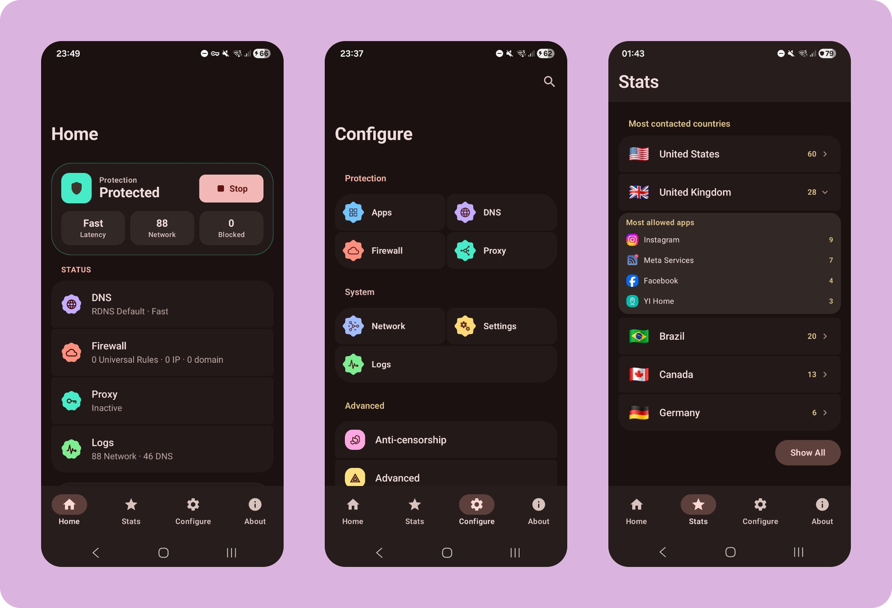
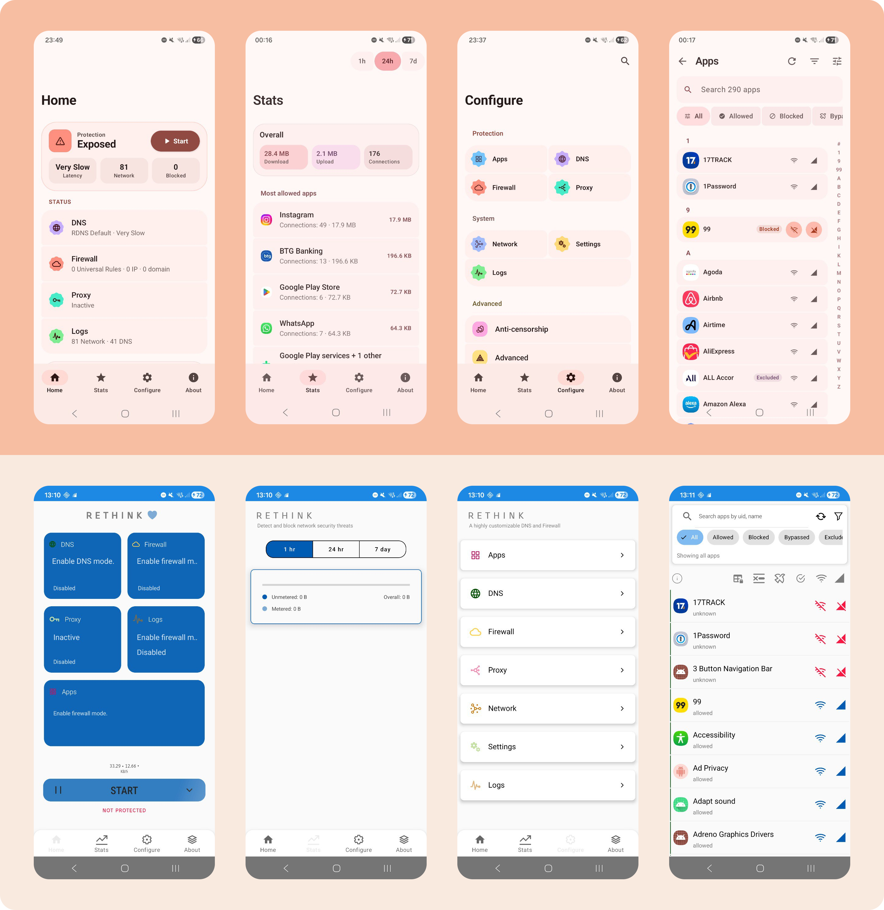
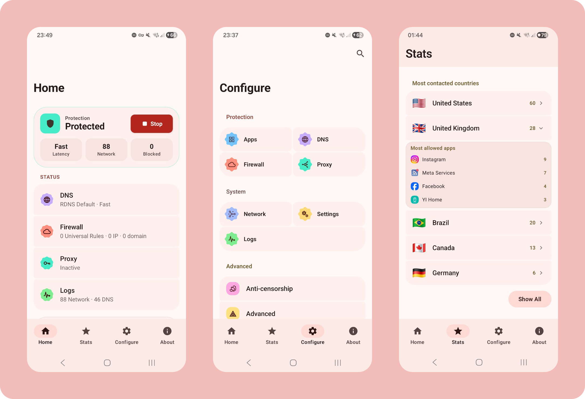

# Re-Rethink

<p align="center">
  
</p>

<p align="center">
  <strong>Take control of your Android device's network traffic without requiring root access.</strong><br>
  A WireGuard client, OpenSnitch-inspired firewall, and pi-hole-inspired DNS client with blocklists. Built with Kotlin, Jetpack Compose, and Material 3 Expressive.
</p>

<p align="center">
  <a href="https://kotlinlang.org/"></a>
  <a href="LICENSE"></a>
  <a href="#"></a>
</p>

---

Re-Rethink is an entirely new project—a modernized, meticulously crafted fork of [Rethink DNS](https://github.com/celzero/rethink-app). It preserves the original's core philosophy—no-root, VPN-based filtering, local-first processing, and rich DNS features—while adding a completely refreshed, first-class Material 3 Expressive Android UX. Expect dynamic workflows, fluid motion, and greater clarity for logs, rules, and settings.

It operates in three primary modes: **VPN**, **DNS**, and **Firewall**. By supporting multiple WireGuard upstreams in a split-tunnel configuration, Re-Rethink allows for advanced tracking and precise control of app connections while using popular encrypted DNS protocols seamlessly.

## 🚀 Key Features

- 🛡️ **Advanced Firewall:** Precisely deny internet access to specific apps based on screen state, background/foreground state, unmetered/metered connections, Play Store categories, or user-defined IP and domain denylists.
- 🎨 **UI-First Redesign:** Built from the ground up for Material 3 Expressive. Features cleaner spacing, dynamic animations, and improved interaction behaviors over the original app.
- 🌐 **Robust DNS:** Route DNS traffic to your chosen DNS-over-HTTPS, DNS-over-TLS, or DNSCrypt resolver. The built-in default resolver seamlessly blocks ads and malware.
- 🔒 **VPN / Proxifier:** Forward TCP & UDP over SOCKS5, HTTP CONNECT, and WireGuard tunnels. Leverage split-tunneling to route different apps over different tunnels concurrently.
- 📊 **Network Monitor:** A comprehensive, per-app report card tracking when and where connections were made via UDP, TCP, and DNS, featuring upgraded traffic timeline views.
- 📱 **No-Root Required:** Total control over your traffic without compromising your Android device's security model.
- 🌍 **Anti-Censorship & Anti-Surveillance:** Engineered to circumvent internet censorship, limit invasive tracking by apps, and enforce privacy.

## 📸 Screenshots

<p align="center">
  
</p>

## ✨ What's New in Re-Rethink

If you are coming from the original Rethink DNS, we've been hard at work refining the app experience. Major differences and recent improvements include:

- **Complete Visual Overhaul:** Built heavily with Jetpack Compose, the app embraces Google's Material 3 Expressive design language for a modern, fluid experience.
- **Improved Log Clarity:** The traffic logs and DNS logs have been completely redesigned with expressive card UI patterns, tonal elevation, and spring animations, so it's clearer which connections were blocked.
- **Polished Settings:** We've grouped settings logically and refined UI toggles, color pickers, and appearance configurations to be deeply consistent.

## ⚙️ How It Works

Re-Rethink operates as a local-only application. It uses Android's built-in `VpnService` to route your device's traffic through a local sinkhole.

Because the app routes the traffic *internally on your device*, **it never sends your data to an external proxy or remote server unless you configure it to**. The application can inspect the outbound connection attempts and selectively drop or allow packets based on the rules you set for each app, providing a true on-device firewall without requiring root access.


## ⚠️ Behavior Notes

- This app is local-first by default.
- Some device manufacturers apply stricter VPN policies; background behavior can vary.
- Certain background/network capabilities depend on notification, battery optimization, and device permissions.

## 🛠️ Technology Stack

- **Language:** Modern [Kotlin](https://kotlinlang.org/).
- **UI Toolkit:** Fully rebuilt with [Jetpack Compose](https://developer.android.com/jetpack/compose) and [Material 3 Expressive](https://m3.material.io/).
- **Concurrency:** Kotlin Coroutines & Flow for asynchronous data streams.
- **Local Storage:** Room Database and DataStore for persistent configurations and logs.

## 📥 Getting Started

To build and run Re-Rethink locally on your machine:

1. Clone this repository:
   ```bash
   git clone https://github.com/bernaferrari/rethink-app.git
   ```
2. Open the project in the latest version of **Android Studio**.
3. Let Gradle sync download all required dependencies.
4. Connect an Android device or start an emulator.
5. Click **Run** (`Shift + F10`).

## 📜 Credits & License

- **Original Project:** [Rethink DNS](https://github.com/celzero/rethink-app)
- **License:** Apache License 2.0. See [`LICENSE`](LICENSE) for details.

<p align="center">
  
</p>

---
<p align="center">Made with ❤️ for an open internet and Jetpack Compose</p>
